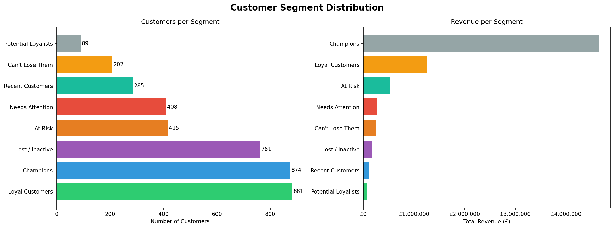
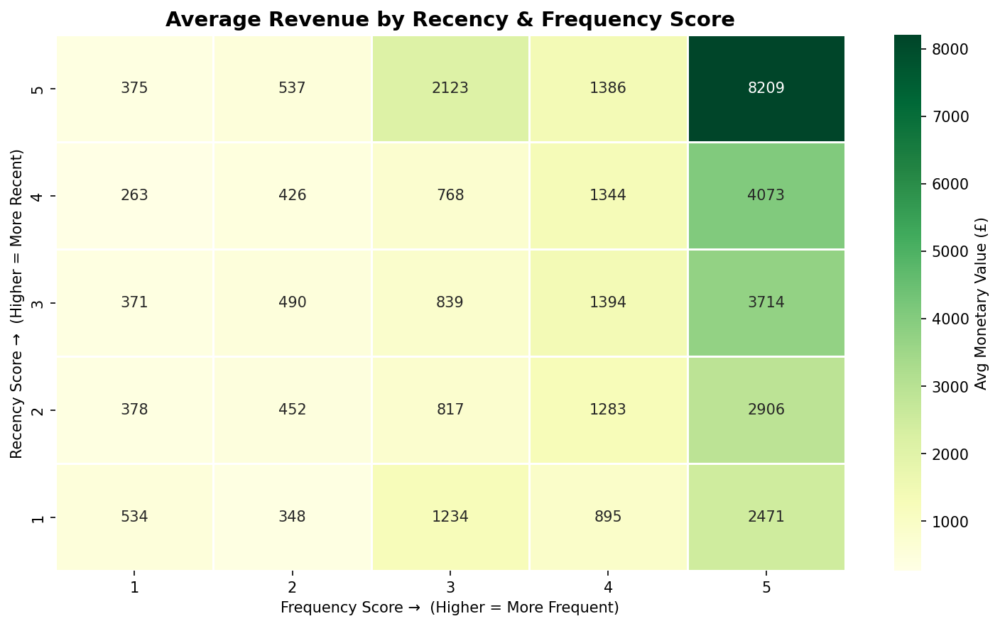

# 🛍️ Customer Segmentation Using RFM Analysis

## Business Problem
How do we identify which customers are most valuable, which are at risk 
of churning, and how should we treat each group differently?

## Objective
Segment e-commerce customers using RFM (Recency, Frequency, Monetary) 
analysis to enable targeted marketing and retention strategies.

## Dataset
- **Source:** [UCI Machine Learning Repository — Online Retail](https://archive.ics.uci.edu/dataset/352/online+retail)
- **Size:** 541,909 transactions
- **Period:** December 2010 – December 2011
- **Region:** United Kingdom

## Tools & Libraries
`Python` · `pandas` · `numpy` · `matplotlib` · `seaborn` · `plotly`

## Key Findings
- **Champions** (top segment) represent X% of customers but drive Y% of revenue
- **At-Risk** customers show high frequency historically but haven't purchased in 90+ days
- Clear revenue concentration among top 2 segments — Pareto principle in action

## Methodology
1. Data loading & exploration
2. Data cleaning (removing nulls, cancellations, negative values)
3. RFM metric calculation
4. Quintile-based scoring (1–5)
5. Rule-based segmentation into 8 customer groups
6. Visualization & business recommendations

## How to Run
```bash
git clone https://github.com/yourusername/customer-segmentation-rfm
cd customer-segmentation-rfm
pip install -r requirements.txt
jupyter notebook notebooks/rfm_analysis.ipynb
```

## Screenshots


